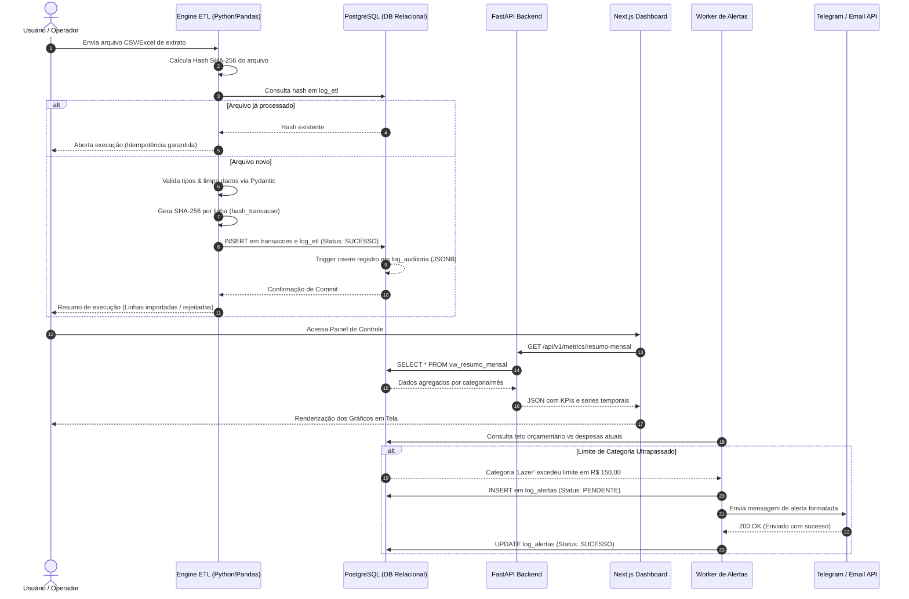

Aqui está o arquivo completo **`docs/01-architecture/data-flow.md`**, pronto para ser adicionado ao seu repositório de documentação.

---

### 📄 Conteúdo do `docs/01-architecture/data-flow.md`

```markdown
# 🔄 Fluxo de Dados & Jornada da Informação

**Projeto:** Ecosystem Financeiro & Analítico (End-to-End)  
**Versão:** 1.0.0  
**Status:** Especificação Técnica Aprovada  

---

## 1. Visão Geral do Ciclo de Vida do Dado

O ciclo de vida da informação no **Ecosystem Financeiro & Analítico** é composto por cinco etapas sequenciais e desacopladas, garantindo integridade desde a captura da fonte até a notificação do usuário final.

```text
  [1. EXTRAÇÃO] ──► [2. TRANSFORMAÇÃO & VALIDAÇÃO] ──► [3. PERSISTÊNCIA & AUDITORIA]
                                                                  │
  [5. AÇÃO & NOTIFICAÇÃO] ◄── [4. EXPOSIÇÃO & CONSUMO] ───────────┘

```

1. **Extração:** Leitura de extratos financeiros brutos (CSV/Excel) e cotações de ativos via APIs de mercado.
2. **Transformação & Validação:** Padronização de tipos, enriquecimento de metadados, validação de esquemas (Pydantic) e cálculo de hash de deduplicação (SHA-256).
3. **Persistência & Auditoria:** Gravação transacional no PostgreSQL, acionamento de triggers de auditoria em `JSONB` e atualização de logs de pipeline (`log_etl`).
4. **Exposição & Consumo:** Leitura via *SQL Views* otimizadas consumidas pela API FastAPI (Endpoints REST) e pelo Power BI (Conectores nativos).
5. **Ação & Notificação:** Avaliação de regras de negócio por workers assíncronos e envio de alertas (Email/Telegram) em caso de desvios orçamentários.

---

## 2. Diagrama de Sequência End-to-End

O diagrama abaixo ilustra o percurso detalhado de uma transação financeira, desde a ingestão do arquivo fonte até a exibição na interface web e eventual disparo de alerta.



---

## 3. Detalhamento Técnico das Etapas do Fluxo

### 3.1. Estágio A: Ingestão e Processamento ETL (Batch)

* **Entrada:** Arquivo `.csv` ou `.xlsx` depositado na pasta `data/input/` ou enviado via upload na API.
* **Processamento em Código (Python):**
1. **Parsing:** O `Pandas` realiza o carregamento do DataFrame inicial.
2. **Sanitização:** Nomes de colunas são convertidos para `snake_case`, espaços extras são removidos e formatos de moeda são convertidos para `float`.
3. **Validação de Schema:** Cada linha do DataFrame é instanciada no modelo `TransacaoIngestaoSchema` do Pydantic. Caso falhe, a linha é redirecionada para um arquivo de quarentena `data/quarantine/erros.csv` e contabilizada em `log_etl.registros_rejeitados`.
4. **Deduplicação por Hash:** É gerada uma string composta:

$$\text{String Base} = \text{data\_transacao} + \text{valor} + \text{descricao} + \text{categoria\_id}$$


A hash SHA-256 dessa string é anexada à coluna `hash_transacao`.


### 3.2. Estágio B: Persistência Relacional e Auditoria

* **Transação Principal:** Operação realizada em um único bloco `db.commit()` no SQLAlchemy.
* **Gravação em Tabelas Core:** Inserção nas tabelas `transacoes` ou `cotacoes_historico`.
* **Mecanismo de Auditoria Automático:**
Uma *Trigger* em PL/pgSQL na tabela `transacoes` monitora alterações:
```sql
-- Conceito do payload gravado na tabela log_auditoria
{
  "tabela": "transacoes",
  "operacao": "INSERT",
  "dados_novos": {
    "id": 1024,
    "valor": 150.00,
    "descricao": "Supermercado",
    "categoria_id": 3
  },
  "executado_em": "2026-10-01T14:30:00Z"
}

```


### 3.3. Estágio C: Exposição de APIs e Visões Analíticas

* **Agregação em Banco:** A visão `vw_resumo_mensal` consolida previamente as transações utilizando `GROUP BY` e `TO_CHAR(data_transacao, 'YYYY-MM')`.
* **Endpoints REST (FastAPI):**
* `GET /api/v1/transacoes`: Consulta paginada com suporte a filtros por intervalo de data e categoria.
* `GET /api/v1/metrics/patrimonio`: Retorna o saldo consolidado (carteira de ativos atualizada pela cotação mais recente + caixa líquido).


### 3.4. Estágio D: Consumo no Frontend Web e Power BI

* **Next.js (Web):** Realiza chamadas assíncronas via `fetch()` para a API REST e renderiza componentes gráficos com Tailwind CSS e bibliotecas de visualização.
* **Power BI Desktop:** Conecta-se diretamente ao PostgreSQL via driver PostgreSQL/ODBC executando consultas nas *Views* analíticas. As métricas avançadas (como variação MoM e acumulado anual) são calculadas dinamicamente via **DAX**.

### 3.5. Estágio E: Motor de Mensageria e Alertas (Worker)

* **Execução:** Script executado periodicamente via agendador (Cron/Worker).
* **Fluxo de Decisão:**
1. Executa a query de verificação de orçamento por categoria no mês vigente.
2. Identifica se `total_gasto > orcamento_mensal_limite`.
3. Verifica se um alerta para essa mesma categoria/mês já foi disparado nas últimas 24 horas (evitando spam de notificações).
4. Se válido, constrói o payload da mensagem e realiza o envio HTTP para a API do Telegram ou servidor SMTP.


---

## 4. Matriz de Mapeamento de Dados (Source-to-Target)

| Campo Fonte (CSV/Extrato) | Campo Alvo (PostgreSQL) | Tabela Alvo | Regra de Transformação / Validação |
| --- | --- | --- | --- |
| `Data`, `Dt Transação` | `data_transacao` | `transacoes` | Converte `DD/MM/YYYY` em `YYYY-MM-DD`. Deve ser $\le$ data atual. |
| `Valor`, `Monto` | `valor` | `transacoes` | Remove símbolos (`R$`), converte `,` para `.`. Valor absoluto $> 0$. |
| `Histórico`, `Descrição` | `descricao` | `transacoes` | Remove caracteres especiais e limita a 150 caracteres. |
| `Categoria` | `categoria_id` | `transacoes` | Busca o `id` correspondente na tabela `categorias` (ou associa 'Outros'). |
| *Calculado em Runtime* | `hash_transacao` | `transacoes` | Algoritmo SHA-256 dos campos fundamentais para deduplicação. |
| *Calculado em Runtime* | `hash_arquivo` | `log_etl` | Algoritmo SHA-256 do arquivo completo no momento do upload. |

```

---

<ElicitationsGroup message="Como prefere prosseguir agora?">
  <Elicitation label="Ir para a Fase 1 da implementação (código Python em src/database/)" query="Vamos para a Fase 1 da implementação: crie o arquivo src/database/database.py com a conexão SQLAlchemy e o arquivo src/database/models.py com os modelos ORM."/>
  <Elicitation label="Criar o arquivo ddl.sql e o dicionário de dados na pasta 02-database" query="Gere os arquivos da pasta docs/02-database: o script ddl.sql completo e o arquivo data-dictionary.md."/>
</ElicitationsGroup>

```